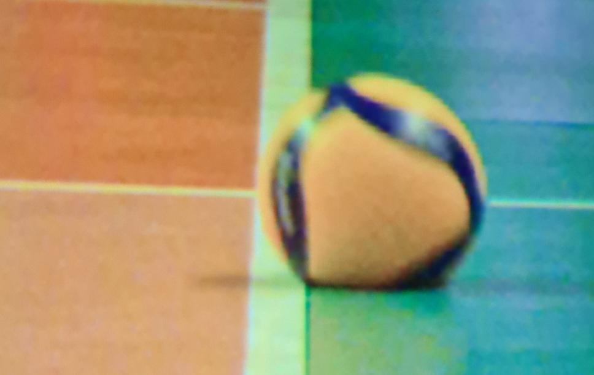

# Volleyball-Line-Detection
Volleyball Line Detection application using image processing techniques for determining In/Out decisions.

| Name | Student Number |
|-----------|-----------|
| Noel McCarthy | C22533826 |
| Karl Negrillo | C22386123 |
| Kimberly Libranza | C22386221 |

# Sample Image:



# Intructions

# Tech Stack
Python Enviornment: Inside Anaconda prompt, use the following to create a Kernel we used to develop this project. 

```console
conda create -n imageproc python=3.11 -c conda-forge
conda activate imageproc
conda install -c conda-forge "numpy>=2,<3" scipy scikit-image opencv matplotlib pillow jupyterlab ipykernel
```
# Video Demonstration

# Contributions

### Noel McCarthy

I developed the line detection pipeline, which automatically detects the relevant volleyball boundary courtline across varied lighting conditions, angles, and image noise levels to support making an in or out decison. 

The pipeline takes a raw court image and produces a binary mask representing the estimated courtline region (full stripe width), which is used for our decision function, alongside a polygon overlay for visualising this and other supporting visuals inside of line-detection.ipynb.

**Preprocessing** involves:
- Light Gaussian denoising
- Color space conversion
- Combined brightness and saturation thresholding to isolate 'white' regions
- Morphological opening and closing to stabilise fragments in boundary line
- Connected components filtering to remove small blobs/specks/additional noise
This produces a clean binary line mask.

**Line Extraction**, the cleaned mask is passed through:
- Canny edge detection
- Standard Hough Transform (Probabilistic Hough was also experimented with)
We detect infinite length line equations rather than short segments, as while the line can be partially broken, we did not need to process this (e.g., line connects)

**Dominant Orientation Estimate**: We compute the median of all detected θ (theta) values to obtain the dominant stripe orientation allowing it to work for:
- Vertical Lines
- Slightly angled lines (distorted perspective)

**Courtline Polygon Construction**: Using the selected Hough lines: 
- Intersections with the top and bottom image borders are computed
- The widest sensible pair of parralel lines are selected (e.g., our boundary line width)
- A 4 point polygon is drawn between them
- A final binary mask is generated
- Overlay on origianl image visualised also in line-detection-final.ipynb

---
